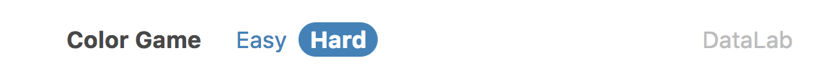

# Lab4 Quiz - Color Game

## 離開前請簽名！！！！

## Grading
#### 1. Hard mode <b>(60%)</b>
* Mode Button
    * Selected button can display another css form (25%)  
    
    * Hoverable Buttons (5%)  
    
    * Display inline (10%)
* 3 cards => 6 cards (15%)

* Can back to easy mode (5%)

#### 2. Nightmare mode <b>(40%)</b>
* Timer
    * Count time from 5 sec to 0 sec (20%)
    
    * Time out (10%)  
    Display correct background color and show "Time out".
    
* No New Color button when counting down (5%)
* Can back to easy mode and hard mode (5%)

#### Bonus
* Blink every 1 sec (10%)

#### Demo Gif

## Submission
Open a new merge request when you finished your quiz.  
We'll accept all merge requests so that you can open new request after the lab (after 17:30). 

## `IMPORTANT` 
From now on, we will not help you to deal with any git problems during the quiz. 
If there's nothing in your branch, you will get 0 points.
